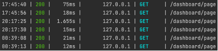

## Capstone Design 2
**로그 데이터를 한 경량 UI/UX 분석 프레임워크**

## 연구 배경
최근 유튜브, 인스타그램, 페이스북 등의 엔터프라이즈 급 서비스에서는 **다양한 데이터를 수집** 한 후에 머신 러닝을 수행 한 다음, 해당 결과를 이용하여 최적의 서비스를 제공 한다. 웹 혹은 어플리케이션에서 가장 많이 수집하는 데이터는 바로 **로그 데이터**이다. 사용자에 특정 비즈니스 로직에 얼마나 관심을 가지고 있는지 판단 하는 지표로 많이 사용하게 되는데, 이를 이용하여 **유사 서비스 추천, 모니터링을 통한 개선점 분석** 등 다양하게 사용 된다.

그렇기 때문에, 스타트업 레벨에서 사용 할 수 있는 **로그 데이터를 통한 경량 UI/UX 분석 프레임워크**를 만들고자 한다. 이는 큰 틀에서의 사용자의 행동을 규정하여 (스크롤 여부, 클릭 여부, 페이지 체류 시간 등) **공통된 로그를 추출** 한 후, 이를 **저장 및 가공**하여 ML 엔지니어들이 **사용하기 좋은 형태**로 만들어 놓는 것을 목표로 한다.

## 연구 내용

### 관련 연구
- [데이터 로그 설계, 데이터 로깅, 이벤트 로그 설계, 데이터 QA의 모든 것](https://zzsza.github.io/data/2021/06/13/data-event-log-definition/)
- [NDC19, 좋은 로그란 무엇인가?](https://speakerdeck.com/devinjeon/jamag-ndc19-joheun-rogeuran-mueosinga-joheun-rogeureul-wihae-goryeohaeya-hal-geosdeul)

### 중요성 / 독창성
1. **보편적인 웹 서비스**에서 사용 할 수 있도록, 컴포넌트에 대한 **인터페이스**를 제공 한다. 어떤 **Cookie 값**으로 유저를 식별 할 것 인지, **어떤 정보를 수집** 할 것인지 사용자가 함수만 호출 하여 사용 할 수 있게 한다.

함수는 **뷰 포트 내 체류 시간**, **마우스 상호 작용 시간** 두 개가 제공 된다.

```js
const target = useRef(null)
const [isIntersecting, setIntersecting] = useState(false)
const { addData } = useContext(LogContext)

const onChangeFunction = loggingViewtimeFunction(isIntersecting, setIntersecting, addData, title, "userId", true)
const onMouseOverFunction = loggingOnMouseOverFunction(title, "userId", addData, true)
const onMouseOutFunction = loggingOnMouseOutFunction(title, "userId", addData, true)

return (
    <VisibilitySensor
        onChange={onChangeFunction}
    >
        <MainContainer
            onMouseOver={onMouseOverFunction}
            onMouseOut={onMouseOutFunction}
        />
    </VisibilitySensor>
)
```

2. **배치 요청**을 통해서 컴포넌트 상호작용과 같이 많은 요청이 오가는 요청에 대해서는 버퍼에 저장 한 후, 한꺼번에 전송한다. [참고 코드](https://github.com/JustKode/capstone-design-2/blob/main/frontend/example/pages/_app.tsx)
3. **페이지 이동 로그** 같은 경우에는 **Next.js Middleware** 단에서 제공 한다. [참고 코드](https://github.com/JustKode/capstone-design-2/blob/main/frontend/example/middleware.ts)
4. 아키텍처를 구성하는 기능들을 분리 함으로, **Scale Out**에 용이 하다.
5. 이렇게 수집 된 로그 데이터를 통하여, 유저 별 **페이지, 컴포넌트 대시보드** 혹은 **컴포넌트 별 점수가 담긴 API**를 제공 하여 유저 분석 및 추후 ML에 사용 할 수 있게 한다.
## 작동 화면

### Architecture
아키텍처는 다음과 같다.

<p align="center">
    
</p>

### 실행 방법
**Docker Componse**를 통해, 실행에 필요한 프로그램들을 실행 할 수 있습니다.

```bash
$ docker-compose up -d
```

각 프로세스 마다 **Dockerfile**이 있어 실행 해 볼 수 있습니다.

- `backend/dashboard`: Dashboard API Server
- `backend/logging`: Log Server
- `backend/process`: Consumer Application
- `frontend/example`: Next.js (Client)
- `frontend/dashboard`: Next.js (Dashboard)

### 서버 실행 화면

<p align="center">
    
    <div align="center">Next.js (Client) Server log</div>
</p>
<br/><br/>
<p align="center">
    
    <div align="center">Dashboard API Server</div>
</p>
<br/><br/>
<p align="center">
    
    <div align="center">Consumer Application</div>
</p>

### 제공되는 API 및 대시보드

<p align="center">
    
    <div align="center">컴포넌트 대시보드 + API</div>
</p>

<br/><br/>

<p align="center">
    
    <div align="center">페이지 대시보드 + API</div>
</p>


## 기대 효과
기술적 자원, 컴퓨팅 자원이 부족한 스타트업 레벨에서의 데이터를 통한 서비스 개선에 있어 적은 비용으로 이를 수행 할 수 있게 해 준다. 또한, 데이터 로깅에 대한 **공통된 인터페이스의 제공**을 통해서, 사용자로 하여금 더 낮은 접근성으로 머신러닝에 사용 할 데이터들을 추출 할 수 있게 하고, 이를 서비스에 적용 할 수 있게 한다.
